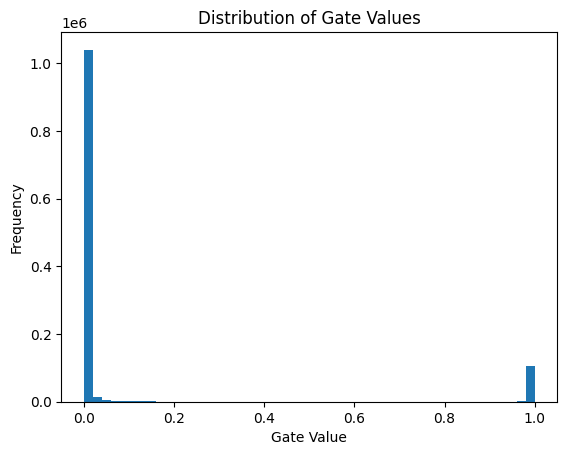

# Self-Pruning Neural Network

This project implements a neural network that **learns to prune its own weights during training** using learnable gates and L1 regularization.

Instead of pruning after training, the model dynamically identifies and removes unnecessary connections, resulting in a **sparse and efficient network**.

---

## Project Overview

Traditional neural network pruning is typically applied after training. In this project, pruning is integrated directly into the training process.

Each weight is associated with a learnable gate parameter. During the forward pass, gate values are computed using a sigmoid function and multiplied element-wise with the weights.

Connections with gate values close to zero become effectively inactive, allowing the model to automatically learn a sparse architecture during training.

The model is trained and evaluated on the **CIFAR-10 dataset**, a standard benchmark for image classification consisting of 60,000 32×32 color images across 10 classes.

---

## Key Idea

Each weight is controlled by a learnable gate:

$$
\text{effective weight} = \text{weight} \times \sigma(\text{gate score})
$$

* If gate → 0 → weight is pruned
* If gate → 1 → weight remains active
---
## How It Works

### 1. Prunable Layer

* Custom `PrunableLinear` layer
* Each weight has a learnable **gate_score**
* Gates computed using sigmoid

---

### 2. Sparsity Loss (L1 Regularization)

Loss = CE + λ × SparsityLoss

* L1 penalty pushes gates toward zero
* Many weights become inactive

---

### 3. Training Strategy

* Optimizer: Adam
* Learning rate scheduling
* Gradient clipping for stability

---

## Tech Stack

* Python
* PyTorch
* Torchvision
* NumPy
* Matplotlib

---

## Project Structure

```text
self-pruning-neural-network/
│
├── self_pruning_model.py   # Full implementation
├── report.md               # Detailed explanation
├── gate_distribution.png   # Plot
├── README.md               # Project overview
```

---

## ⚙️ Installation

```bash
pip install torch torchvision matplotlib
```

---

## ▶️ Run the Project

```bash
python self_pruning_model.py
```
---
## Dataset

The model is trained on the **CIFAR-10 dataset**, which contains:
- 60,000 images (50,000 train + 10,000 test)
- 10 object classes
- 32×32 RGB images

---

## 📊 Results

| Lambda | Accuracy (%) | Sparsity (%) |
| ------ | ------------ | ------------ |
| 0.1    | 80.07        | 51.03        |
| 1      | 79.53        | 59.93        |
| 5      | 79.24        | 72.21        |
| 10     | 78.87        | 79.71        |
| 20     | 78.66        | 85.61        |

---

## 📈 Key Observations

* Increasing λ increases sparsity
* Accuracy remains stable up to moderate sparsity
* Model retains strong performance even at ~85% sparsity

👉 This shows neural networks are **highly overparameterized**

---

## 📊 Gate Value Distribution (for best model , λ=20) 



* Large spike at **0** → pruned connections
* Cluster near **1** → important connections

👉 Confirms successful pruning (bimodal distribution)

---


---

## Key Takeaways

* Neural networks contain many redundant parameters
* L1-regularized gates can enable **dynamic pruning**
* High sparsity can be achieved with minimal accuracy loss
* Self-pruning models are useful for **efficient deployment**
  
---

##  Author
**Samyak Rawat**  

This project was developed as part of an assignment for **Tredence Analytics**.  
